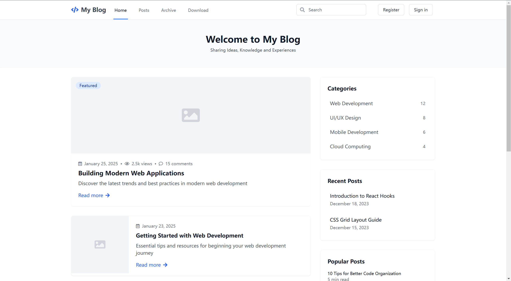

# blog

> 🚧 **Status**: Under active development. Features are being added and refined.

Open-source blog system with Gin, GORM, SQLite, JWT middleware backend, and Tailwind CSS frontend. Features admin dashboard, comments, tags, categories. Simple, fast, self-hosted, customizable.

blog/
├── main.go                # Main application entry
├── config/               # Configuration directory
│   └── config.go         # Config structure and loading logic
├── router/               # Router layer for request handling
│   ├── router.go        # Main router configuration
│   ├── web/             # Web routes
│   │   ├── home.go      # Home page routes
│   │   ├── post.go      # Post routes
│   │   ├── category.go  # Category routes
│   │   └── user.go      # User routes
│   └── api/             # API routes
│       └── v1/          # API version 1
├── model/               # Data model layer
│   ├── post.go          # Blog post model
│   ├── user.go          # User model
│   └── category.go      # Category model
├── service/             # Business logic layer
│   ├── page_service.go  # Page related services
│   ├── message_service.go # Message handling service
│   ├── like_service.go  # Like/Rating service
│   ├── download_service.go # Download handling service
│   ├── category_service.go # Category management service
│   └── post_service.go  # Blog post service
├── pkg/                 # Reusable packages
│   ├── cache/          # Cache management package
│   └── logger/         # Logging package
├── middleware/          # Custom middleware
│   └── jwt.go          # JWT authentication middleware
├── template/            # HTML template files
│   └── default/        # Default theme
│       ├── layout/     # Layout templates
│       │   └── base.html # Base layout
│       ├── post/       # Post related pages
│       │   ├── list.html # Post list page
│       │   └── detail.html # Post detail page
│       └── static/     # Static resource files
│           ├── css/    # Style files
│           │   └── style.css # Compiled TailwindCSS file
│           ├── js/     # JavaScript files
│           └── img/    # Image resources
├── data/               # Data storage directory
│   ├── db/            # Database files (SQLite)
│   ├── upload/        # Upload files storage
│   ├── temp/          # Temporary files
│   └── log/           # Application log files
├── utils/             # Utility functions
│   └── tools.go       # Common tools and utilities
├── go.mod             # Go module file
├── go.sum             # Go dependency lockfile
├── package.json       # Node.js package config (for TailwindCSS)
└── tailwind.config.js # TailwindCSS configuration

Directory Structure:
1. main.go: Application entry point, initialization and server startup
2. config: Configuration files and loading logic
3. router: Route definitions and request handling
   - router.go: Main router configuration
   - web/: Web-related routes
   - post.go: Blog post routes
   - category.go: Category routes
   - user.go: User routes
   - api/: API routes
   - api/v1/: API version 1
4. model: Data model definitions
5. service: Business logic implementation
   - page_service.go: Page management
   - message_service.go: Message handling
   - like_service.go: Like/Rating system
   - download_service.go: Download management
   - category_service.go: Category operations
   - post_service.go: Post management
6. pkg: Reusable packages and components
   - cache: Cache management package
   - logger: Logging package
7. middleware: Authentication and other middleware components
8. template: HTML template files and themes
   - default: Default theme with layouts and pages
9. data: Data storage directory
   - db: Database files (SQLite)
   - upload: Upload files storage
   - temp: Temporary files
   - log: Application log files
10. utils: Utility functions and tools

Tech Stack:
- Gin: Web framework
- SQLite: Database
- Redis: External cache system + Built-in cache
- GORM: ORM framework for database operations
- HTML Template: Template engine
- TailwindCSS: CSS framework 
- JWT middleware for authentication
- Configuration management with INI file

## License

This project is free and open source software for non-commercial use only. Commercial use is strictly prohibited. You can use it for personal projects, learning purposes, or non-profit organizations.

